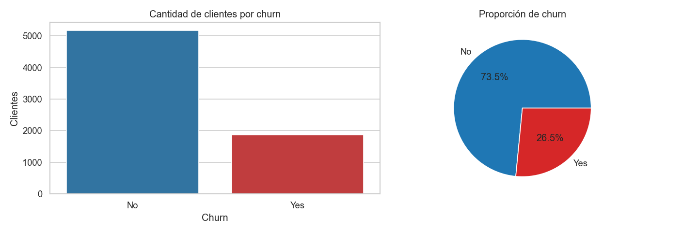
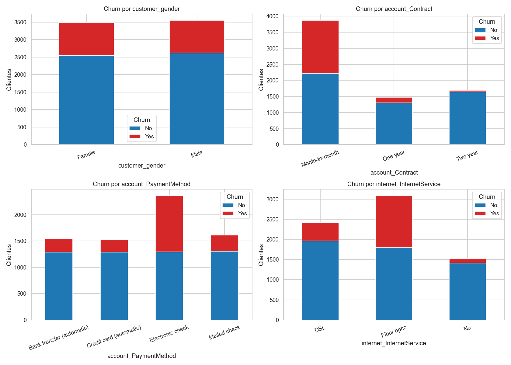
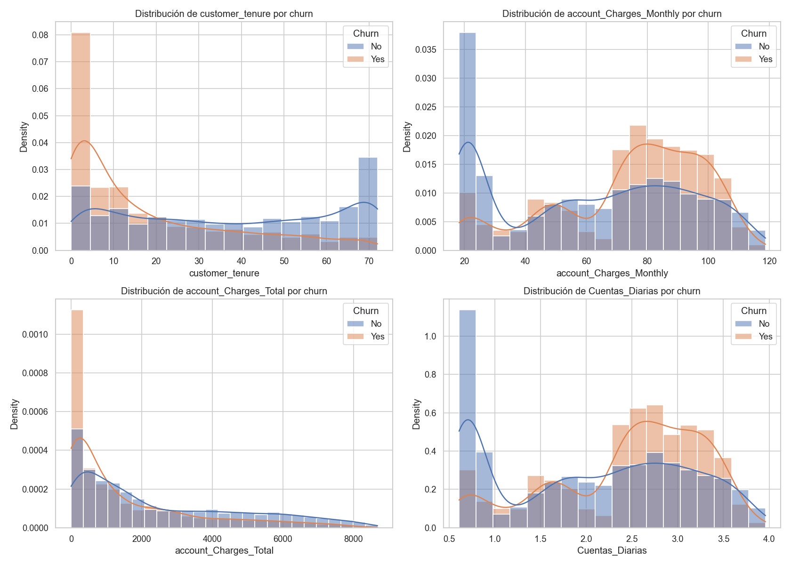
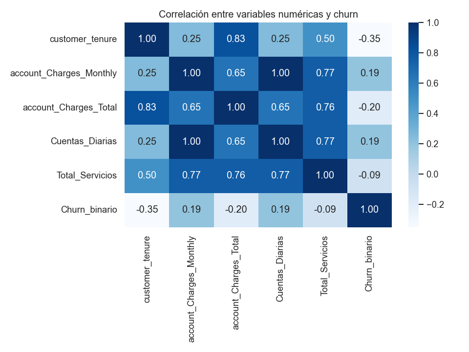

# 📊 Análisis de Churn — TelecomX LATAM

Análisis exploratorio de datos sobre la evasión de clientes de Telecom X, utilizando Python, Pandas, Matplotlib y Seaborn.

---

## 📌 Extracción

Los datos se cargan directamente desde la API pública en formato JSON y se convierten a un DataFrame plano de Pandas mediante `pd.json_normalize`.

```python
DATA_URL = "https://raw.githubusercontent.com/ingridcristh/challenge2-data-science-LATAM/main/TelecomX_Data.json"
```

Dataset inicial: **7 267 filas × 21 columnas**.

---

## 🔧 Transformación

### Conoce el conjunto de datos

| Columna | Tipo | Descripción |
|---|---|---|
| customerID | object | Identificador único del cliente |
| Churn | object | Indica si el cliente canceló el servicio |
| customer_gender | object | Género del cliente |
| customer_SeniorCitizen | int64 | Cliente con 65 años o más |
| customer_Partner | object | Cliente con pareja |
| customer_Dependents | object | Cliente con dependientes |
| customer_tenure | int64 | Meses de permanencia |
| phone_PhoneService | object | Suscripción al servicio telefónico |
| phone_MultipleLines | object | Múltiples líneas telefónicas |
| internet_InternetService | object | Tipo de servicio de internet |
| internet_OnlineSecurity | object | Servicio de seguridad en línea |
| internet_OnlineBackup | object | Respaldo en línea |
| internet_DeviceProtection | object | Protección del dispositivo |
| internet_TechSupport | object | Soporte técnico |
| internet_StreamingTV | object | Streaming de TV |
| internet_StreamingMovies | object | Streaming de películas |
| account_Contract | object | Tipo de contrato |
| account_PaperlessBilling | object | Facturación sin papel |
| account_PaymentMethod | object | Método de pago |
| account_Charges_Monthly | float64 | Cargo mensual |
| account_Charges_Total | object | Cargo total acumulado |

---

### Comprobación de incoherencias en los datos

| Columna | Valores faltantes |
|---|---|
| Churn | 224 |
| account_Charges_Total | 11 |

- **Duplicados totales:** 0
- **Categorías revisadas:** `Churn`, `phone_PhoneService`, `phone_MultipleLines`, `internet_InternetService`, `account_Contract`, `account_PaymentMethod`

---

### Manejo de inconsistencias

- Se eliminaron los 224 registros con `Churn` ausente.
- Los 11 valores faltantes de `account_Charges_Total` correspondían a clientes con `customer_tenure == 0` → se completaron con `0`.

**Dataset limpio: 7 043 filas × 21 columnas.**

---

### Columna de cuentas diarias (Opcional)

Se creó la columna `Cuentas_Diarias = account_Charges_Monthly / 30`.

| account_Charges_Monthly | Cuentas_Diarias |
|---|---|
| 29.85 | 1.00 |
| 56.95 | 1.90 |
| 53.85 | 1.80 |

---

### Estandarización y transformación de datos (Opcional)

Se crearon columnas binarias (Yes → 1, No → 0) para: `Churn`, `customer_Partner`, `customer_Dependents`, `account_PaperlessBilling`.

| Variable | Antes | Después (_binario) |
|---|---|---|
| Churn | Yes / No | 1 / 0 |
| customer_Partner | Yes / No | 1 / 0 |
| customer_Dependents | Yes / No | 1 / 0 |
| account_PaperlessBilling | Yes / No | 1 / 0 |

---

## 📊 Carga y análisis

### Análisis Descriptivo

| Variable | count | mean | std | min | 25% | 50% | 75% | max | mediana | varianza |
|---|---|---|---|---|---|---|---|---|---|---|
| customer_tenure | 7043 | 32.37 | 24.56 | 0.00 | 9.00 | 29.00 | 55.00 | 72.00 | 29.00 | 603.17 |
| account_Charges_Monthly | 7043 | 64.76 | 30.09 | 18.25 | 35.50 | 70.35 | 89.85 | 118.75 | 70.35 | 905.41 |
| account_Charges_Total | 7043 | 2279.73 | 2266.79 | 0.00 | 398.55 | 1394.55 | 3786.60 | 8684.80 | 1394.55 | 5 138 357.00 |
| Cuentas_Diarias | 7043 | 2.16 | 1.00 | 0.61 | 1.18 | 2.34 | 2.99 | 3.96 | 2.34 | 1.01 |

---

### Distribución de evasión

| Churn | Porcentaje |
|---|---|
| No | 73.46% |
| Yes | 26.54% |



---

### Recuento de evasión por variables categóricas

**Por género:**

| Género | No (%) | Yes (%) |
|---|---|---|
| Female | 73.08 | 26.92 |
| Male | 73.84 | 26.16 |

**Por tipo de contrato:**

| Contrato | No (%) | Yes (%) |
|---|---|---|
| Month-to-month | 57.29 | **42.71** |
| One year | 88.73 | 11.27 |
| Two year | 97.17 | 2.83 |

**Por método de pago:**

| Método de pago | No (%) | Yes (%) |
|---|---|---|
| Bank transfer (automatic) | 83.29 | 16.71 |
| Credit card (automatic) | 84.76 | 15.24 |
| Electronic check | 54.71 | **45.29** |
| Mailed check | 80.89 | 19.11 |

**Por servicio de internet:**

| Servicio de internet | No (%) | Yes (%) |
|---|---|---|
| DSL | 81.04 | 18.96 |
| Fiber optic | 58.11 | **41.89** |
| No | 92.60 | 7.40 |



---

### Conteo de evasión por variables numéricas

| Variable | Media (No) | Mediana (No) | Media (Yes) | Mediana (Yes) |
|---|---|---|---|---|
| customer_tenure | 37.57 | 38.00 | 17.98 | 10.00 |
| account_Charges_Monthly | 61.27 | 64.43 | 74.44 | 79.65 |
| account_Charges_Total | 2549.91 | 1679.52 | 1531.80 | 703.55 |
| Cuentas_Diarias | 2.04 | 2.15 | 2.48 | 2.66 |



---

### Análisis de correlación entre variables (Opcional)

| | customer_tenure | account_Charges_Monthly | account_Charges_Total | Cuentas_Diarias | Total_Servicios | Churn_binario |
|---|---|---|---|---|---|---|
| customer_tenure | 1.00 | -0.25 | 0.83 | -0.25 | 0.01 | -0.35 |
| account_Charges_Monthly | -0.25 | 1.00 | 0.65 | 1.00 | 0.53 | 0.19 |
| account_Charges_Total | 0.83 | 0.65 | 1.00 | 0.65 | 0.26 | -0.20 |
| Cuentas_Diarias | -0.25 | 1.00 | 0.65 | 1.00 | 0.53 | 0.19 |
| Total_Servicios | 0.01 | 0.53 | 0.26 | 0.53 | 1.00 | -0.02 |
| Churn_binario | -0.35 | 0.19 | -0.20 | 0.19 | -0.02 | 1.00 |



---

## 📄 Informe final

### Tasa general de churn

| Churn | Porcentaje |
|---|---|
| No | 73.46% |
| Yes | 26.54% |

### Churn por tipo de contrato

| Contrato | No (%) | Yes (%) |
|---|---|---|
| Month-to-month | 57.29 | **42.71** |
| One year | 88.73 | 11.27 |
| Two year | 97.17 | 2.83 |

### Churn por método de pago

| Método de pago | No (%) | Yes (%) |
|---|---|---|
| Bank transfer (automatic) | 83.29 | 16.71 |
| Credit card (automatic) | 84.76 | 15.24 |
| Electronic check | 54.71 | **45.29** |
| Mailed check | 80.89 | 19.11 |

### Promedios de variables clave por churn

| Churn | customer_tenure | account_Charges_Monthly | account_Charges_Total | Cuentas_Diarias | Total_Servicios |
|---|---|---|---|---|---|
| No | 37.57 | 61.27 | 2549.91 | 2.04 | 3.04 |
| Yes | 17.98 | 74.44 | 1531.80 | 2.48 | 2.68 |

---

### Conclusiones del análisis

#### Introducción
El objetivo de este análisis fue estudiar la evasión de clientes de Telecom X, identificando patrones asociados a la variable Churn y generando información útil para orientar acciones de retención.

#### Limpieza y tratamiento de datos
Los datos se cargaron desde la fuente JSON oficial y se transformaron a un DataFrame plano de Pandas. Se detectaron 224 registros con churn ausente y 11 valores faltantes en `account_Charges_Total`. Los registros sin churn se excluyeron y los cargos totales faltantes en clientes nuevos (tenure = 0) se completaron con 0. También se creó la variable `Cuentas_Diarias` y columnas binarias para facilitar el análisis.

#### Análisis exploratorio de datos
El churn general fue de **26.54%**. La evasión se concentra en:
- Contratos **Month-to-month**: 42.71% de churn
- Pago con **Electronic check**: 45.29% de churn
- Internet **Fiber optic**: 41.89% de churn

Los clientes que cancelan tienen en promedio menor permanencia (**17.98 meses** vs 37.57) y mayor cargo mensual (**$74.44** vs $61.27).

#### Conclusiones e insights
La permanencia es el factor más importante para explicar la evasión. También destacan como señales de alerta los contratos mensuales, el pago con Electronic check y el servicio Fiber optic. Los clientes que cancelan pagan más por mes pero acumulan menor gasto total, consistente con una salida temprana.

#### Recomendaciones
- Priorizar retención en clientes con contrato **Month-to-month**, especialmente con **Electronic check** o **Fiber optic**.
- Diseñar ofertas de migración hacia contratos anuales.
- Revisar la percepción de valor en clientes con cargos mensuales elevados.
- Establecer campañas de retención durante los **primeros meses** de permanencia.
